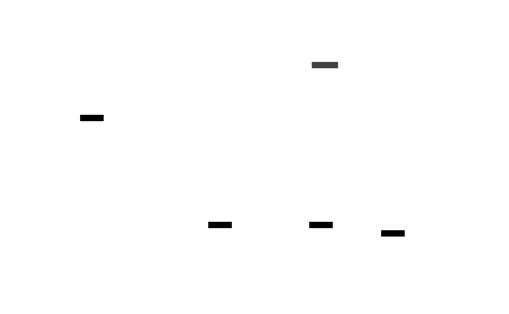

# Visitor pattern

Visitor is a behavioral design pattern that allows adding new behaviors to existing class hierarchy without altering any existing code using a combination of double dispatch and method overloading.

[implementation](visitor.ts)

## UML diagram

